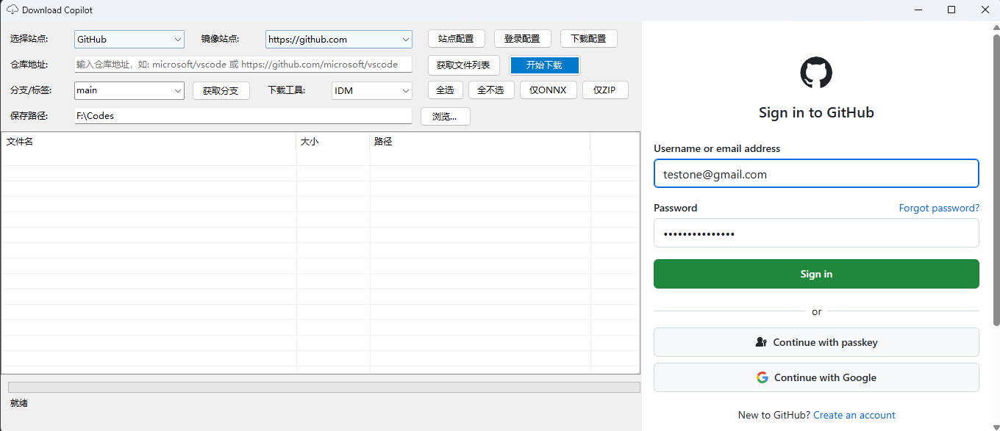
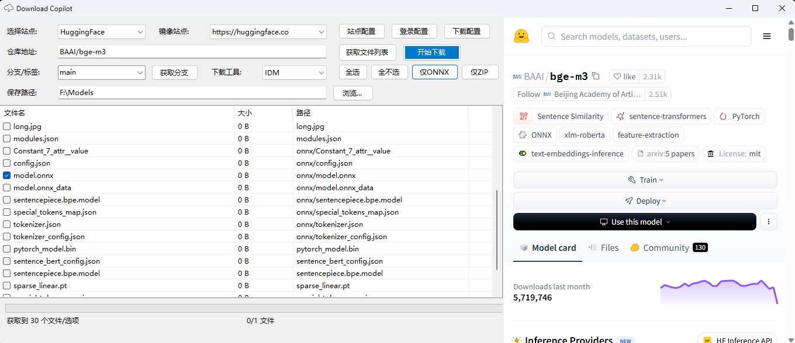

<h1>Download Copilot</h1>

English | <a href="./docs/readme_cn.md">中文</a> 

An assistant to help you download files from Github and Huggingface.

## 特性

- **Browsing Interaction**: Built-in browser supports a certain degree of two-way interaction;
- **One-click Download**: Supports integration with download tools such as IDM and Aria2 for one-click downloading;
- **Branch Support**: Supports retrieving and downloading files from a specified branch;
- **Filtering**: Github supports direct download of compressed archives, while Huggingface supports filtering of onnx files; both also support selecting files for download from a file list;
- **Mirror Site**: Multiple built-in mirror sites and support for custom mirror sites accelerate your download experience;
- **Automatic Login**: Supports configuring a Github account for automatic login, eliminating the need to manually enter a password;

## 截图

- Automatic login  

- Two-way interaction

- Get branch    

- Call IDM to download    

- Fetch model files from Huggingface

- Download from mirror site    

## Feedback

Issues and suggestions are welcome.

## License

[Apache-2.0 license](LICENSE)
