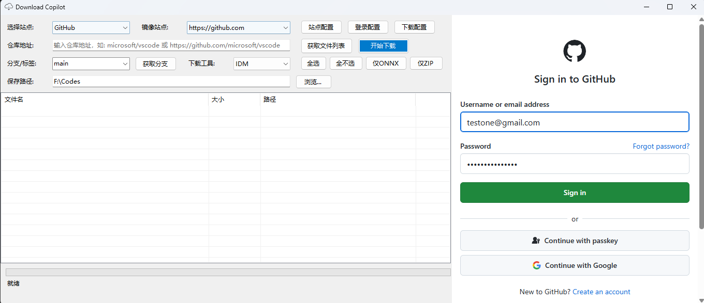
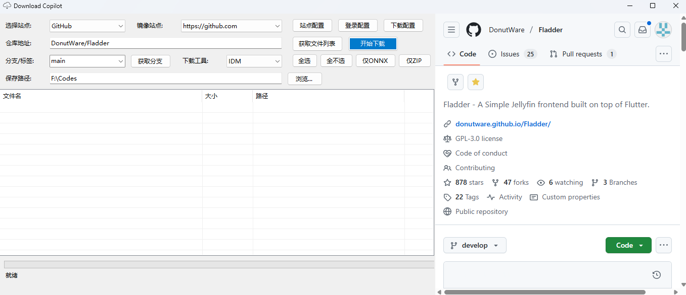
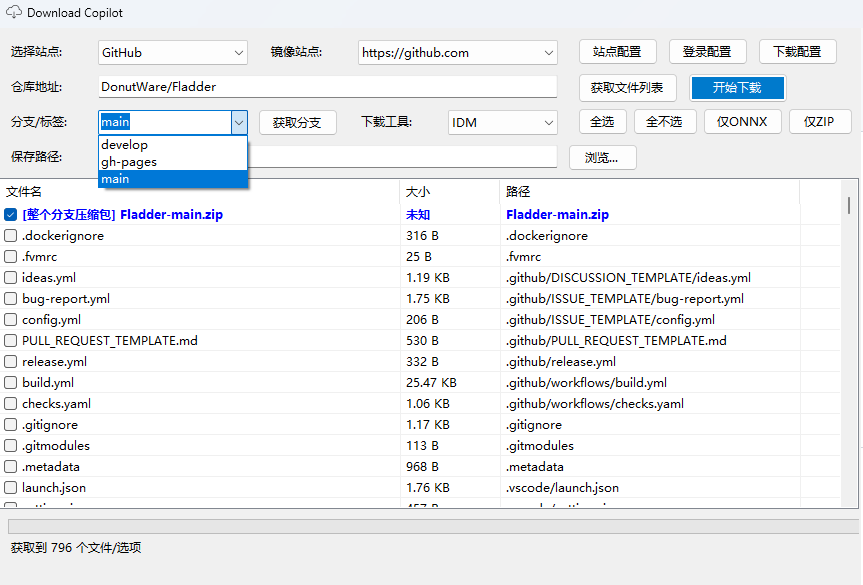
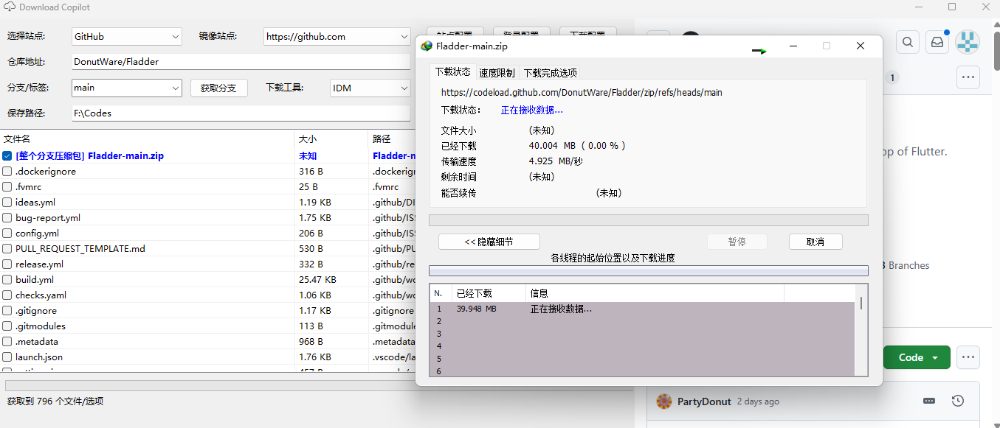
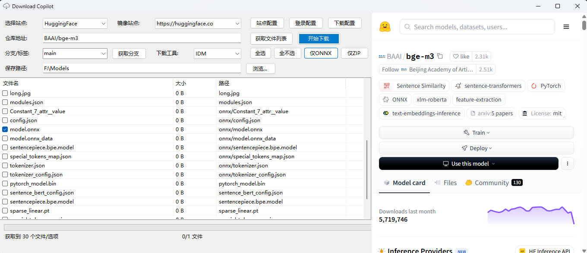
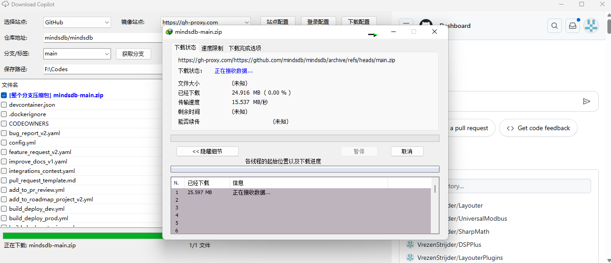



<h1>Download Copilot</h1>

<a href="./readme.md">English</a> | 中文 

一款帮你从 Github 和 Huggingface 下载文件的工具助手

## 特性

- **浏览交互**：内嵌浏览器，支持一定程度的双向交互;
- **一键下载**：支持绑定IDM,Aria2等下载工具，实现一键下载;
- **分支支持**：支持获取指定分支的文件并下载;
- **筛选功能**：Github支持直接下载压缩包，Huggingface支持筛选onnx文件; 并且都支持从文件列表中选择文件下载;
- **镜像站点**：内置多个镜像站点，并且支持自定义镜像站点，加速你的下载体验;
- **自动登录**：支持配置Github的账户，配置后自动登录，无需手动输入密码;

## 截图

- 自动登录  

- 双向交互

- 获取分支    

- 调用IDM下载    

- 从Huggingface获取模型文件列表 

- 通过镜像下载    

## 反馈

欢迎提出问题和建议

## 协议

[Apache-2.0 license](LICENSE)